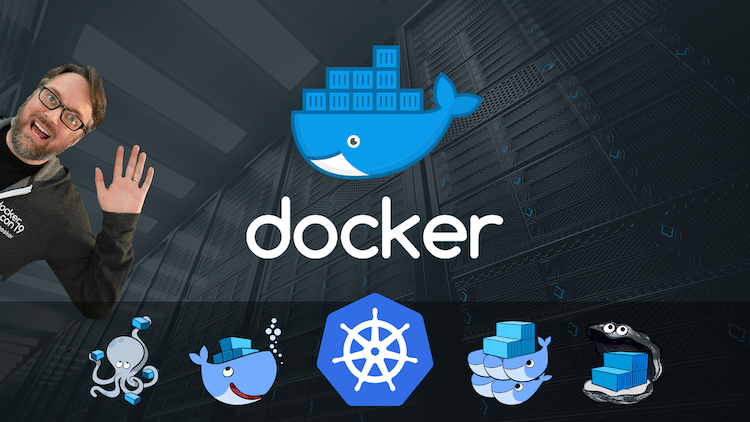

# Docker Mastery 🐳

    

Source code for [Docker Mastery: with Kubernetes + Swarm from a Docker Captain](https://www.udemy.com/course/docker-mastery/)

## Assignments

- [Assignment 1](assignment01): Manage Multiple Containers
- [Assignment 2](assignment02): CLI App Testing
- [Assignment 3](assignment03): DNS Round Robin Test
- [Assignment 4](assignment04): Build Your Own Image
- [Assignment 5](assignment05): Named Volumes
- [Assignment 6](assignment06): Bind Mounts
- [Assignment 7](assignment07): Writing A Compose File
- [Assignment 8](assignment08): Compose For On-The-Fly Image Building and Multi-Container Testing
